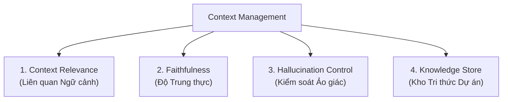

# CONTEXT MANAGEMENT - QUẢN LÝ NGỮ CẢNH LLM

Quản lý Ngữ cảnh là nền tảng quyết định độ chính xác của AI Agent. Đảm bảo LLM luôn làm việc đúng phạm vi, không đoán mò và không tạo thông tin giả.

---

## 4 Trụ cột Quản lý Ngữ cảnh

### 1. Context Relevance (Chỉ cung cấp Thông tin Liên quan)
- **Nguyên tắc**: Không gửi toàn bộ codebase vào prompt. Chỉ cung cấp đúng file, module hoặc chữ ký hàm mà task hiện tại đang tương tác.
- **Rủi ro khi vi phạm**: Càng nhiều thông tin rác, mô hình càng dễ mất tập trung (Lost in the Middle) và sinh code lan man.
- **Thực hành**:
  - Khi làm việc với `src/data/transforms.py`, chỉ nạp thông tin về thư viện augmentations và định dạng ảnh đầu vào, không nạp mã nguồn model hay loss function.

### 2. Faithfulness (Bám sát Codebase & Tài liệu)
- **Nguyên tắc**: Mọi câu trả lời, class, hàm và biến sinh ra phải có nguồn gốc từ codebase hiện hữu hoặc tài liệu chính thức được cung cấp.
- **Thực hành**:
  - Yêu cầu AI luôn trích dẫn file tham chiếu: *"Dựa theo cấu trúc trong `configs/config.yaml`, hãy triển khai hàm load config..."*.
  - Tuyệt đối không chấp nhận các hàm import từ những thư viện không có trong `requirements/`.

### 3. Hallucination Control (Kiểm soát Ảo giác & Tự suy diễn)
- **Nguyên tắc**: Nghiêm cấm AI tự ý suy diễn các yêu cầu chưa được người dùng chỉ định.
- **Quy tắc Vàng cho AI**:
  > *"Nếu thông tin hoặc yêu cầu chưa rõ ràng trong tài liệu, AI PHẢI đặt câu hỏi làm rõ thay vì tự ý bịa đặt giải thuật, số liệu hoặc file mới."*
- **Kỹ thuật hạn chế**:
  - Sử dụng ràng buộc âm (Negative Constraints): *"Không tự ý thêm tham số ngoài danh sách sau..."*
  - Yêu cầu trả về `NotImplementedError` hoặc `pass` khi chưa có yêu cầu chi tiết.

### 4. Knowledge Store (Kho Tri thức Tham chiếu)
- **Nguyên tắc**: Xây dựng một tập hợp tài liệu chuẩn hóa để AI tra cứu thay vì phải "đoán":
  - `agents/AI_REFERENCE.md`: Quy ước đặt tên, cấu trúc thư mục.
  - `configs/`: Định dạng các file YAML chuẩn.
  - `docs/`: Đặc tả yêu cầu kỹ thuật của bài lab.
- **Cơ chế hoạt động**: Khi nhận task, AI đọc Knowledge Store trước, sau đó mới tiến hành sinh mã.

---

## Checklist Thẩm định Ngữ cảnh Trước khi Prompts

- [ ] Context cung cấp có bị thừa thông tin không liên quan không?
- [ ] Các đường dẫn file trong prompt có tồn tại thực tế trong repository không?
- [ ] Thư viện được yêu cầu có nằm trong danh mục cho phép của môn học không?
- [ ] Đã có tài liệu tham chiếu chuẩn trong Knowledge Store cho task này chưa?
