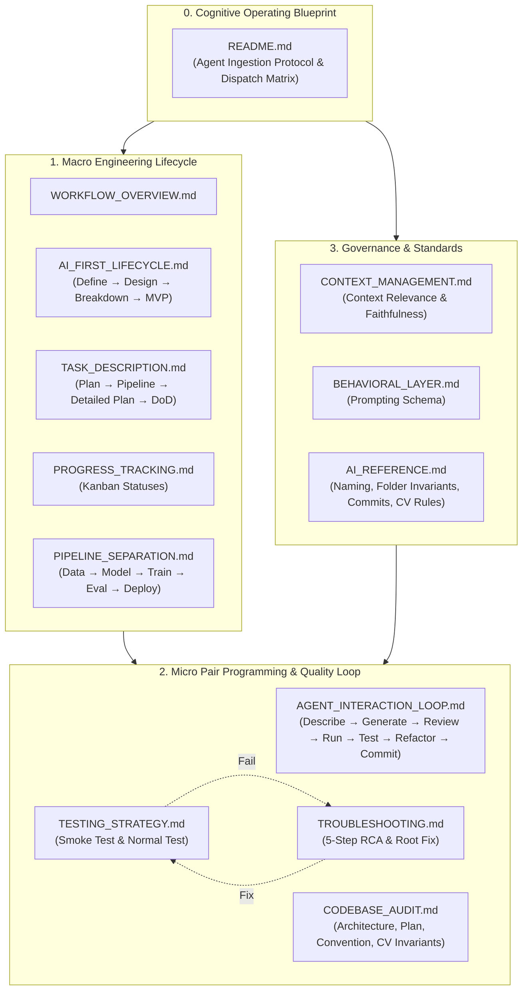

# AI AGENT WORKFLOW SYSTEM - THE COGNITIVE OPERATING BLUEPRINT

Hệ thống quy trình kỹ thuật chuẩn hóa, vòng đời phát triển và quy chuẩn chất lượng cao nhất cho AI Agent & Kỹ sư trong các dự án Thị giác Máy tính (Computer Vision) & MLOps.

Thư mục này đóng vai trò là **Bộ não Thứ hai (Second Brain)** của Kỹ sư. Mỗi khi bắt đầu một dự án mới, chỉ cần đưa thư mục `agents/` vào repository và yêu cầu: *"Đọc thư mục agents/ và bắt đầu làm việc"*. Agent sẽ lập tức tiếp nhận 100% tư duy thiết kế, ranh giới Clean Architecture, chu trình phát triển 9 giai đoạn và các luật bất biến kỹ thuật để triển khai chính xác tuyệt đối mọi yêu cầu.

---

## 1. Giao thức Tiếp nhận Nhận thức cho AI Agent (Agent Cognitive Protocol)

Khi được yêu cầu đọc thư mục `agents/`, AI Agent phải tự động thực thi quy trình tiếp nhận 4 bước:

```text
[ Bước 1: Role Alignment ] ──► Thiết lập nhân cách Principal CV/MLOps Engineer & Pair Programmer
          │
          ▼
[ Bước 2: Context Anchoring ] ──► Quét cấu trúc repository, nhận diện ranh giới module và file scaffold
          │
          ▼
[ Bước 3: Task Routing ] ──► Phân loại yêu cầu vào Macro Lifecycle (1-9) hoặc Micro Loop (7 bước)
          │
          ▼
[ Bước 4: Contract Output ] ──► Xuất hợp đồng kỹ thuật (Scope, Shapes, Plan, DoD) trước khi code
```

### Bước 1: Thiết lập Tư thế Nhận thức (Role Alignment)
- Bạn đang hoạt động như **Second Brain** của Kỹ sư.
- Tinh thần làm việc: Chính xác, kỷ luật, Clean Architecture, lập trình phòng thủ (Fail-Fast), không đoán mò, không viết code thừa.

### Bước 2: Khóa Ranh giới & Neo Ngữ cảnh (Context Anchoring)
- Quét cấu trúc repository hiện tại: `configs/`, `data/`, `docs/`, `experiments/`, `notebooks/`, `requirements/`, `scripts/`, `src/`, `tests/`.
- Nhận diện trạng thái **Pure Scaffolding**: Toàn bộ file template 0-byte phải được giữ sạch sẽ, chỉ chỉnh sửa khi có task cụ thể được chỉ định.
- Khóa toàn bộ các điều cấm kỵ tại [`AI_REFERENCE.md`](AI_REFERENCE.md) (không print, không for loops duyệt pixel, không hardcode path/params).

### Bước 3: Phân luồng Nhiệm vụ (Task Routing)
- Nếu Kỹ sư đưa ra bài toán/đề tài mới: Tham chiếu [`AI_FIRST_LIFECYCLE.md`](AI_FIRST_LIFECYCLE.md) để lập bản đặc tả DEFINE (7 trụ cột) và DESIGN (7 thành phần).
- Nếu Kỹ sư giao một task cụ thể: Tham chiếu [`TASK_DESCRIPTION.md`](TASK_DESCRIPTION.md) và chạy chu trình vi mô [`AGENT_INTERACTION_LOOP.md`](AGENT_INTERACTION_LOOP.md).

### Bước 4: Định dạng Phản hồi Bắt buộc (Contract-First Response Schema)
Trước khi sinh hoặc sửa bất kỳ dòng mã nguồn nào, Agent **bắt buộc** cấu trúc phản hồi theo đúng 4 phần:
1. **Scope & Tensor Contracts**: File mục tiêu, Tensor shapes `(B, C, H, W)` hoặc `(H, W, C)`, dtypes, device (`to(device)`), thư viện sử dụng.
2. **Detailed Execution Plan & DoD**: Từng bước code cụ thể từ Interface → Validation → Core Math → Corner Cases kèm tiêu chuẩn hoàn thành.
3. **Production Code**: Mã nguồn chuẩn PEP 484 Type Hints, Google-style docstrings, 100% vector hóa, không dùng `print()`, không magic numbers.
4. **Self-Audit & Verification Status**: Báo cáo kiểm toán 3 tầng ([`CODEBASE_AUDIT.md`](CODEBASE_AUDIT.md)) và trạng thái kiểm thử Smoke/Normal test ([`TESTING_STRATEGY.md`](TESTING_STRATEGY.md)).

---

## 2. Bản đồ Phản xạ Nhận thức (Cognitive Dispatch Matrix)

Khi tiếp nhận bất kỳ mệnh lệnh nào từ Kỹ sư, Agent tự động tra cứu bảng phản xạ sau để đọc đúng tài liệu và hành động chuẩn mực:

| Ý định của Kỹ sư | Tài liệu Quy trình Tham chiếu | Hành động Chuẩn mực của Agent |
| :--- | :--- | :--- |
| Bắt đầu bài lab mới / Lên ý tưởng dự án | [`AI_FIRST_LIFECYCLE.md`](AI_FIRST_LIFECYCLE.md) | Phân tích bài toán, xuất bản đặc tả DEFINE (7 trụ cột) và DESIGN (7 thành phần). |
| Giao task / Lên kế hoạch tính năng | [`TASK_DESCRIPTION.md`](TASK_DESCRIPTION.md), [`PROGRESS_TRACKING.md`](PROGRESS_TRACKING.md) | Phân rã Plan → Pipeline → Detailed Plan → DoD, cập nhật trạng thái Kanban. |
| Yêu cầu sinh mã nguồn (Code Generation) | [`AI_REFERENCE.md`](AI_REFERENCE.md), [`AGENT_INTERACTION_LOOP.md`](AGENT_INTERACTION_LOOP.md) | Sinh code chuẩn PEP 484, docstring tensor shapes, 100% vector hóa, không `print()`. |
| Kiểm tra / Review mã nguồn | [`CODEBASE_AUDIT.md`](CODEBASE_AUDIT.md) | Thẩm định 3 tầng (Kiến trúc, Plan, Conventions) + 5 Bất biến CV/DL (Shapes, Color spaces, Memory). |
| Viết kiểm thử / Chạy test | [`TESTING_STRATEGY.md`](TESTING_STRATEGY.md) | Viết Smoke Test (@pytest.mark.smoke, < 5s) và Normal Test (shapes, numerical invariants). |
| Gặp lỗi crash / bug runtime / OOM / NaN | [`TROUBLESHOOTING.md`](TROUBLESHOOTING.md) | Phân tích nguyên nhân gốc rễ 5 bước (RCA: Reproduce, Trace, Invariants, Memory, Root Fix). |
| Tối ưu hóa / Refactor mã nguồn | [`AI_FIRST_LIFECYCLE.md`](AI_FIRST_LIFECYCLE.md) (Pha 7), [`CODEBASE_AUDIT.md`](CODEBASE_AUDIT.md) | Vector hóa triệt để, tách hằng số vào `configs/`, kiểm tra rò rỉ GPU memory. |
| Lưu vết phiên bản / Commit | [`AI_REFERENCE.md`](AI_REFERENCE.md) (Mục 4) | Tạo Conventional Commit message chuẩn format `<type>(<scope>): <subject>`. |
| Viết báo cáo bài lab / Tài liệu hóa | [`AI_FIRST_LIFECYCLE.md`](AI_FIRST_LIFECYCLE.md) (Pha 9) | Tổng hợp bảng số liệu định lượng, phân tích định tính, đính kèm seed tái lập. |

---

## 3. Mẫu Phản hồi Xác nhận Tiếp nhận (Cold-Start Acknowledgement)

Khi Kỹ sư yêu cầu: *"Đọc thư mục agents/ và chuẩn bị làm việc"*, Agent đọc xong và lập tức phản hồi theo mẫu chuẩn sau:

```text
Tôi đã tiếp nhận toàn bộ hệ thống quy trình kỹ thuật từ thư mục agents/.

Trạng thái sẵn sàng hoạt động (Second Brain Active):
1. Nhân cách vận hành: Principal CV/MLOps Engineer & Pair Programmer.
2. Neo ngữ cảnh: Đã nhận diện ranh giới Clean Architecture, phân cấp thư mục và trạng thái Pure Scaffolding (0-byte).
3. Cam kết bất biến: Zero-Assumption, 100% Vector hóa (0 pixel loops), tách biệt config/code, Dual-Testing trước khi hoàn thành.
4. Quy trình sẵn sàng: Macro Lifecycle (9 giai đoạn) và Micro Pair-Programming Loop (7 bước).

Xin mời Kỹ sư đưa ra bài toán DEFINE/DESIGN hoặc chỉ định Task cần thực hiện!
```

---

## 4. Danh mục Quy trình Kỹ thuật Hoàn chỉnh (Workflow Directory)

Hệ thống bao gồm 12 tài liệu quy trình chuyên sâu được phân bổ theo 4 trụ cột kỹ thuật:

| File Quy trình | Trụ cột Nghiệp vụ | Mục đích & Trọng tâm Kỹ thuật |
| :--- | :--- | :--- |
| [`WORKFLOW_OVERVIEW.md`](WORKFLOW_OVERVIEW.md) | **Tổng quan** | Toàn cảnh luồng thực thi khép kín từ Requirement → Complete kết nối Macro Loop và Micro Loop. |
| [`AI_FIRST_LIFECYCLE.md`](AI_FIRST_LIFECYCLE.md) | **Vòng đời Vĩ mô** | 9 giai đoạn phát triển: DEFINE (7 trụ cột), DESIGN (7 thành phần), BREAKDOWN, MVP, IMPLEMENT, TEST, REFACTOR, COMMIT, DOCUMENT. |
| [`AGENT_INTERACTION_LOOP.md`](AGENT_INTERACTION_LOOP.md) | **Chu trình Vi mô** | Chu trình pair-programming 7 bước: Describe → Generate → Review → Run → Test → Refactor → Commit. |
| [`CONTEXT_MANAGEMENT.md`](CONTEXT_MANAGEMENT.md) | **Quản trị Ngữ cảnh** | 4 trụ cột kiểm soát LLM: Context Relevance, Faithfulness, Hallucination Control, Knowledge Store. |
| [`BEHAVIORAL_LAYER.md`](BEHAVIORAL_LAYER.md) | **Đặc tả Hành vi** | Markdown Schema 7 trường chuẩn hóa hành vi và luồng công việc của Agent. |
| [`TASK_DESCRIPTION.md`](TASK_DESCRIPTION.md) | **Đặc tả Tác vụ** | Quy trình phân cấp: Plan → Pipeline → Detailed Execution Plan → Definition of Done (DoD). |
| [`PROGRESS_TRACKING.md`](PROGRESS_TRACKING.md) | **Quản lý Tiến độ** | Quản trị trạng thái Kanban (`To Do`, `In Progress`, `Done`, `On Hold`, `Cancelled`) và luật Single-WIP. |
| [`PIPELINE_SEPARATION.md`](PIPELINE_SEPARATION.md) | **Kiến trúc Module** | Phân tách 5 pipelines độc lập: Data Prep, Model Definition, Training, Evaluation, Deployment. |
| [`AI_REFERENCE.md`](AI_REFERENCE.md) | **Quy chuẩn & Bất biến** | Naming Conventions, Folder Invariants, Negative Constraints, Conventional Commits và 5 Bất biến CV/DL (Shapes, Color spaces, Box formats, Seed, GPU Hygiene). |
| [`CODEBASE_AUDIT.md`](CODEBASE_AUDIT.md) | **Kiểm toán Mã nguồn** | Kiểm toán 3 tầng (Kiến trúc, Plan, Conventions) + 5 tiêu chuẩn an toàn chuyên sâu CV/DL. |
| [`TESTING_STRATEGY.md`](TESTING_STRATEGY.md) | **Chiến lược Kiểm thử** | Kiểm thử 2 chế độ: Smoke Test (< 5s) vs Normal Test (Đầy đủ) & Pytest patterns. |
| [`TROUBLESHOOTING.md`](TROUBLESHOOTING.md) | **Xử lý Sự cố & RCA** | Quy trình phân tích nguyên nhân gốc rễ 5 bước (RCA) và cẩm nang xử lý 6 sự cố kinh điển (OOM, NaN, Shape, Deadlock, BGR/RGB, Leakage). |

---

## 5. Sơ đồ Kiến trúc Vận hành Nhận thức



---

## 6. 4 Cổng Kiểm soát Chất lượng Tuyệt đối (The 4 Quality Gates)

Trước khi chấp nhận bất kỳ mã nguồn nào vào dự án:
1. **Gate 1 - Context Gate**: Agent không tự suy diễn, bám sát `configs/` và tài liệu tham chiếu ([`CONTEXT_MANAGEMENT.md`](CONTEXT_MANAGEMENT.md)).
2. **Gate 2 - Design Gate**: Luôn có hợp đồng Input/Output shapes, Plan và DoD trước khi sinh code ([`TASK_DESCRIPTION.md`](TASK_DESCRIPTION.md)).
3. **Gate 3 - Audit Gate**: Vượt qua thẩm định 3 tầng kiến trúc, quy chuẩn và 5 bất biến CV/DL ([`CODEBASE_AUDIT.md`](CODEBASE_AUDIT.md)).
4. **Gate 4 - Test Gate**: Pass 100% Smoke Test (< 5s) và Normal Test với Pytest trước khi xác nhận Done ([`TESTING_STRATEGY.md`](TESTING_STRATEGY.md)). Nếu test fail, kích hoạt ngay quy trình phân tích nguyên nhân gốc rễ tại [`TROUBLESHOOTING.md`](TROUBLESHOOTING.md), tuyệt đối không dùng `try-except pass` che giấu lỗi.
