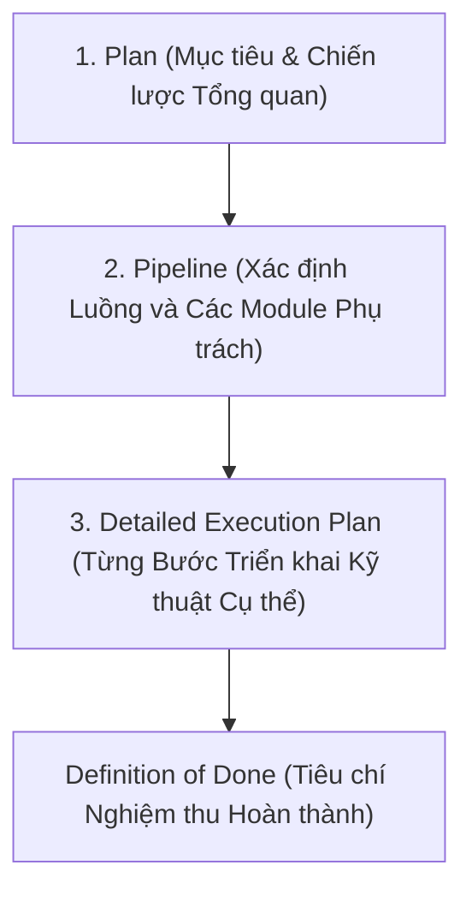

# TASK DESCRIPTION - QUY TRÌNH MÔ TẢ CÔNG VIỆC CHI TIẾT

Mọi tác vụ phải được mô tả chi tiết theo cấu trúc phân cấp: **Plan → Pipeline → Detailed Execution Plan** trước khi viết bất kỳ dòng code nào.

---

## Cấu trúc 3 Cấp độ của Task Description



### Cấp độ 1: Plan (Kế hoạch Cấp cao)
- **Mục tiêu**: Nêu rõ bài toán cần giải quyết và giá trị mang lại.
- **Phạm vi**: Những gì thuộc phạm vi (In-Scope) và những gì KHÔNG làm (Out-of-Scope).
- **Ví dụ**: *"Xây dựng module tính toán chỉ số Intersection over Union (IoU) và mean IoU (mIoU) cho bài toán Object Detection."*

### Cấp độ 2: Pipeline (Xác định Luồng Xử lý)
- **Luồng dữ liệu**: Xác định các module nào trong `src/` sẽ tham gia vào pipeline này.
- **Ranh giới trách nhiệm**:
  - Module nào chuẩn bị input?
  - Module nào thực hiện tính toán cốt lõi?
  - Module nào ghi nhận kết quả và log?

### Cấp độ 3: Detailed Execution Plan (Kế hoạch Thực thi Chi tiết)
- Mô tả từng bước viết code theo thứ tự tuyến tính:
  1. **Step 1 (Interface)**: Khởi tạo hàm với đầy đủ Type Hints trong `src/common/metrics.py`.
  2. **Step 2 (Input Validation)**: Kiểm tra kích thước bounding box `[x1, y1, x2, y2]`, đảm bảo `x2 >= x1` và `y2 >= y1`.
  3. **Step 3 (Core Math)**: Tính diện tích giao nhau (Intersection area) và diện tích hợp (Union area).
  4. **Step 4 (Corner Cases)**: Xử lý trường hợp không giao nhau hoặc diện tích hợp bằng 0.
  5. **Step 5 (Unit Test)**: Tạo file test trong `tests/test_metrics.py` kiểm tra với các trường hợp biết trước kết quả.

---

## Mẫu Task Description Chuẩn (`task_template.md`)

```markdown
# Task: [Tên Task Cụ Thể]

## 1. Plan (Mục tiêu)
- Goal:
- In-Scope:
- Out-of-Scope:

## 2. Pipeline Mapping
- Target File: `src/...`
- Test File: `tests/...`
- Config File: `configs/...`

## 3. Detailed Execution Plan
- [ ] Step 1: Định nghĩa interface và type annotations
- [ ] Step 2: Triển khai kiểm tra tính hợp lệ dữ liệu (validation)
- [ ] Step 3: Triển khai thuật toán xử lý chính
- [ ] Step 4: Xử lý trường hợp ngoại lệ (Edge cases / Zero division)
- [ ] Step 5: Viết Unit Test và kiểm tra độ bao phủ

## 4. Definition of Done (DoD)
- [ ] Code pass `make lint` không có cảnh báo
- [ ] Test cases pass 100% với `pytest`
- [ ] Không có magic numbers hardcode
```
