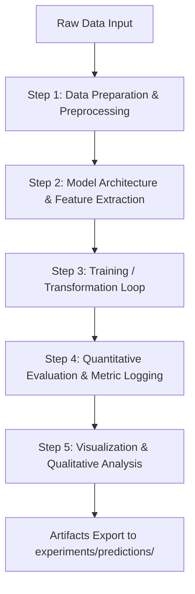

# BÁO CÁO KẾT QUẢ THỰC HÀNH LAB [SỐ LAB]
## BÀI THỰC HÀNH: [TÊN BÀI THỰC HÀNH]

- **Môi trường**: Python 3.x | OpenCV 5.x | PyTorch / Pillow

---

## 1. Mục Tiêu Bài Thực Hành
1. [Mục tiêu 1]
2. [Mục tiêu 2]
3. [Mục tiêu 3]

---

## 2. Thiết Kế Kỹ Thuật & Lộ Trình Thực Thi

### 2.1. Bảng Lộ Trình Thực Thi Chuẩn Hóa (Execution Roadmap)

| Step | Description | What it does | Import path |
| :---: | :--- | :--- | :--- |
| **1** | **Import Libraries & Env Check** | Khởi tạo thư viện, kiểm tra phiên bản và device | `—` |
| **2** | **Data Preparation & Loaders** | Chuẩn bị dữ liệu, chia tập và nạp batch | [`src/data/datamodule.py`](../../src/data/datamodule.py) |
| **3** | **Explore Dataset & Statistics** | Thống kê shape, phân bố lớp và điểm ảnh | [`src/common/visualizer.py`](../../src/common/visualizer.py) |
| **4** | **Model Architecture Definition** | Định nghĩa kiến trúc mạng hoặc thuật toán lọc | [`src/models/classical/__init__.py`](../../src/models/classical/__init__.py) |
| **5** | **Execution / Training Pipeline** | Điều phối vòng lặp thực thi và tối ưu hóa | [`src/pipelines/train.py`](../../src/pipelines/train.py) |
| **6** | **Evaluation & Benchmark** | Tính toán các chỉ số đo lường định lượng | [`src/common/metrics.py`](../../src/common/metrics.py) |
| **7** | **Visualizations & Predictions** | Trực quan hóa kết quả dự đoán và phân tích lỗi | [`src/common/visualizer.py`](../../src/common/visualizer.py) |

### 2.2. Sơ đồ Luồng Công Việc Trực quan (Visual Workflow Pipeline)

---

## 3. Nội Dung Chi Tiết & Kết Quả Thực Nghiệm

[Mô tả chi tiết từng bước, bảng số liệu định lượng và hình ảnh trực quan]

---

## 4. Kiểm Thử & Kiểm Toán Chất Lượng

- Unit Tests: `pytest tests/ -v`
- Linting: `ruff check src tests`

---

## 5. Tài Liệu Tham Khảo (References & Technical Documentation)

### 5.1. Thư viện Cốt lõi & Tài liệu API Chính thức
- [OpenCV Official Documentation](https://docs.opencv.org/): Hướng dẫn API xử lý ảnh, biến đổi không gian và hệ thống hàm vẽ.
- [Pillow (PIL) Documentation](https://pillow.readthedocs.io/): Module xử lý ảnh số, quản lý định dạng và kênh màu RGB.
- [NumPy Documentation](https://numpy.org/doc/stable/): Thao tác mảng đa chiều `np.ndarray`, slicing vector hóa và broadcasting.
- [Matplotlib Pyplot Guide](https://matplotlib.org/stable/api/pyplot_summary.html): Trực quan hóa dữ liệu, biểu đồ lưới đa kênh và lưu đồ họa.

### 5.2. Tiêu chuẩn Kỹ thuật & Không gian Màu
- **ITU-R BT.601 / Rec. 601**: Tiêu chuẩn chuyển đổi ảnh màu sang Grayscale thông qua hệ số phát xạ $Y = 0.299R + 0.587G + 0.114B$.
- **CIE 1976 ($L^*a^*b^*$ / CIELAB)**: Không gian màu đồng đều về mặt cảm nhận thị giác người do Ủy ban Chiếu sáng Quốc tế ban hành.
- **HSV / HSL Color Model**: Mô hình nón màu phân tách sắc thái màu (Hue), độ bão hòa (Saturation) và cường độ sáng (Value).

### 5.3. Quy ước Thị giác Máy tính & Tọa độ
- **Pascal VOC Bounding Box Format**: Quy ước tọa độ hộp bao `[xmin, ymin, xmax, ymax]` góc trên-trái và góc dưới-phải (0-indexed).
- **BGR vs RGB Memory Layout**: Quy ước lưu trữ kênh màu BGR trong OpenCV C++ heritage so với chuẩn RGB hiện đại.

### 5.4. Liên kết Mã Nguồn Dự Án (Clean Architecture)
- [`src/data/transforms.py`](../../src/data/transforms.py): Module biến đổi ảnh vector hóa.
- [`src/common/visualizer.py`](../../src/common/visualizer.py): Module trực quan hóa kết quả.
- [`src/pipelines/lab01_pipeline.py`](../../src/pipelines/lab01_pipeline.py): Bộ điều phối pipeline tự động.

