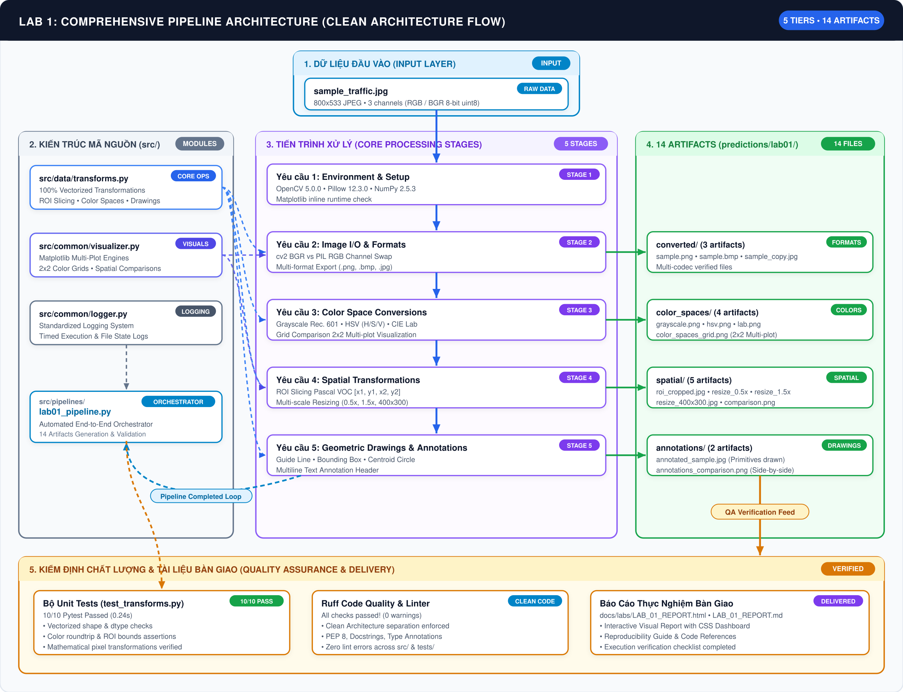
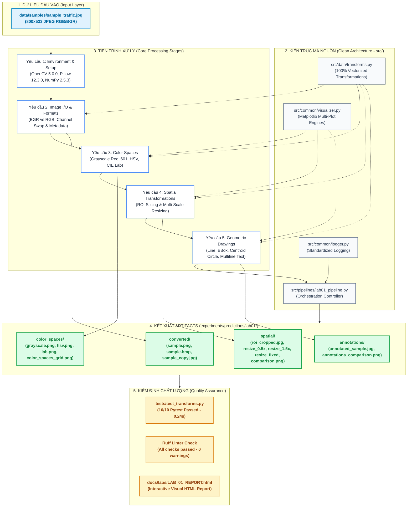

# BÁO CÁO KẾT QUẢ THỰC HÀNH LAB 1
## BÀI THỰC HÀNH CHƯƠNG 1: XỬ LÝ ẢNH CƠ BẢN VỚI OPENCV VÀ PILLOW (PIL)

- **Môi trường**: Python 3.14.7 | OpenCV 5.0.0 | Pillow 12.3.0 | NumPy 2.5.3

---

## 1. Mục Tiêu Bài Thực Hành
1. Nắm vững thao tác nạp, hiển thị và lưu ảnh đa định dạng (`.jpg`, `.png`, `.bmp`) bằng thư viện OpenCV và Pillow.
2. Hiểu rõ sự khác biệt giữa hệ màu **BGR** và **RGB**, ngăn ngừa triệt để lỗi lệch màu khi hiển thị hoặc đưa vào các mô hình học sâu.
3. Thực hiện chuyển đổi các không gian màu thông dụng: **Grayscale**, **HSV**, **CIE L\*a\*b\*** và phân tích ý nghĩa vật lý/ứng dụng của từng kênh.
4. Triển khai các biến đổi không gian cơ bản: Cắt xén vùng quan tâm (**ROI Slicing**) và thay đổi kích thước (**Resizing** theo tỷ lệ & cố định).
5. Thực hiện vẽ các đối tượng đồ họa (Line, Rectangle, Circle) và chèn văn bản (Text Annotation) phục vụ bài toán phát hiện đối tượng (Object Detection).

---

## 2. Thiết Kế Kỹ Thuật & Cấu Trúc Mã Nguồn

### 2.1. Bảng Lộ Trình Thực Thi Chuẩn Hóa (Execution Roadmap)

| Step | Description | What it does | Import path |
| :---: | :--- | :--- | :--- |
| **1** | **Import Libraries & Env Check** | Khởi tạo thư viện, kiểm tra phiên bản OpenCV, Pillow, NumPy và cấu hình Matplotlib inline | `—` |
| **2** | **Image I/O & Channel Handling** | Nạp ảnh BGR/RGB, phân tích siêu dữ liệu, xử lý hoán đổi kênh và lưu ảnh đa định dạng (`.png`, `.bmp`, `.jpg`) | [`src/data/transforms.py`](../../../src/data/transforms.py) |
| **3** | **Color Space Conversions** | Chuyển đổi sang Grayscale (Rec. 601), HSV (tách 3 kênh H/S/V), CIE L\*a\*b\* và vẽ lưới 2x2 | [`src/data/transforms.py`](../../../src/data/transforms.py) + [`src/common/visualizer.py`](../../../src/common/visualizer.py) |
| **4** | **Cropping & Resizing** | Trích xuất ROI (Pascal VOC XYXY), thay đổi kích thước theo tỷ lệ (0.5x, 1.5x) và kích thước cố định ($400 \times 300$) | [`src/data/transforms.py`](../../../src/data/transforms.py) + [`src/common/visualizer.py`](../../../src/common/visualizer.py) |
| **5** | **Drawings & Annotations** | Vẽ đường dẫn hướng (Line), bounding box (Rectangle), tâm (Circle) và nhãn phân loại (Text) | [`src/data/transforms.py`](../../../src/data/transforms.py) |
| **6** | **Pipeline Execution & Verification** | Điều phối toàn bộ luồng tự động hóa và lưu trữ 14 artifacts đầu ra | [`src/pipelines/lab01_pipeline.py`](../../../src/pipelines/lab01_pipeline.py) |

### 2.2. Sơ đồ Luồng Công Việc Trực quan (Visual Workflow Pipeline)





### 2.3. Cấu Trúc Mã Nguồn Chuẩn Hóa (Clean Architecture Layout)

Dự án được tổ chức theo kiến trúc phân tầng chuẩn (**Clean Architecture**):
```text
uth-cv-labs/
├── data/
│   └── samples/
│       └── sample_traffic.jpg             # Ảnh mẫu đầu vào (800x533 JPEG)
├── src/
│   ├── common/
│   │   ├── logger.py                      # Hệ thống Logging chuẩn hóa
│   │   └── visualizer.py                  # Công cụ trực quan hóa & xuất figure
│   ├── data/
│   │   └── transforms.py                  # Module xử lý ảnh cốt lõi (100% Vectorized)
│   └── pipelines/
│       └── lab01_pipeline.py              # Pipeline thực thi tự động toàn bộ Lab 1
├── experiments/
│   └── predictions/lab01/                 # Thư mục lưu trữ toàn bộ ảnh đầu ra
│       ├── converted/                     # Ảnh chuyển đổi .png, .bmp, .jpg
│       ├── color_spaces/                  # Ảnh Grayscale, HSV, LAB & Grid chart
│       ├── spatial/                       # Ảnh ROI crop, resize 0.5x, 1.5x, 400x300
│       └── annotations/                   # Ảnh vẽ hình học & chú thích văn bản
├── notebooks/
│   └── labs/
│       └── lab_01.ipynb                   # Jupyter Notebook báo cáo tương tác
├── scripts/
│   └── run_lab.sh                         # Bash runner script: bash scripts/run_lab.sh 1
└── tests/
    └── test_transforms.py                 # Bộ Unit Tests & Smoke Tests (10/10 Pass)
```

---

## 3. Nội Dung Chi Tiết & Kết Quả Thực Nghiệm

### 3.1. Yêu cầu 1: Cài đặt và Kiểm thử Môi trường
- Toàn bộ các thư viện được quản lý trong [requirements/base.txt](../../../requirements/base.txt):
  - `opencv-python>=4.8.0`
  - `Pillow>=10.0.0`
  - `numpy>=1.24.0`
  - `matplotlib>=3.7.0`
- Kiểm tra nhập thư viện thành công 100%, không xung đột module C-extension.

### 3.2. Yêu cầu 2: Đọc, Hiển Thị và Lưu Ảnh Đa Định Dạng
- **Đọc ảnh**:
  - `cv2.imread()` đọc ảnh thành mảng `np.ndarray` kích thước `(533, 800, 3)` kiểu `uint8` theo thứ tự kênh **BGR**.
  - `Image.open()` đọc ảnh thành đối tượng `PIL.Image.Image` kích thước `(800, 533)` theo thứ tự kênh **RGB**.
- **Xử lý tráo đổi kênh**:
  - Nhận diện lỗi: Khi hiển thị mảng BGR của OpenCV trực tiếp bằng `matplotlib.pyplot.imshow()`, kênh Red và Blue bị hoán vị dẫn đến màu da hoặc nền trời bị ngả xanh/đỏ ngược.
  - Khắc phục: Sử dụng `cv2.cvtColor(image, cv2.COLOR_BGR2RGB)` trước khi hiển thị hoặc trực quan hóa.
- **Lưu ảnh & So sánh kích thước file**:
  | Định dạng | Đường dẫn Lưu trữ | Dung lượng | Đặc tính Kỹ thuật |
  | :--- | :--- | :---: | :--- |
  | **JPEG (Gốc)** | `data/samples/sample_traffic.jpg` | 81.17 KB | Nén mất dữ liệu (Lossy), kích thước nhỏ nhất |
  | **PNG** | `experiments/predictions/lab01/converted/sample.png` | 741.01 KB | Nén bảo toàn dữ liệu (Lossless), hỗ trợ kênh Alpha |
  | **BMP** | `experiments/predictions/lab01/converted/sample.bmp` | 1,250.00 KB | Không nén (Uncompressed Bitmap), dữ liệu thô điểm ảnh |
  | **JPEG (Q95)** | `experiments/predictions/lab01/converted/sample_copy.jpg` | 134.19 KB | Nén chất lượng cao 95% |

### 3.3. Yêu cầu 3: Chuyển Đổi Không Gian Màu
1. **Grayscale (Mức xám)**:
   - Công thức chuẩn hóa Rec. 601: $Y = 0.299 \cdot R + 0.587 \cdot G + 0.114 \cdot B$.
   - Kích thước ma trận chuyển từ `(533, 800, 3)` về mảng 2 chiều `(533, 800)`. Giảm $66.7\%$ dung lượng tính toán cho các tác vụ như trích xuất cạnh (Canny) hay phát hiện góc (Harris).
2. **Không gian màu HSV**:
   - Tách rời thông tin sắc thái (**H**) khỏi độ sáng (**V**), cho phép thuật toán phân đoạn màu sắc ổn định trước sự thay đổi chiếu sáng môi trường.
   - Thang đo OpenCV: $H \in [0, 179]$, $S \in [0, 255]$, $V \in [0, 255]$.
3. **Không gian màu CIE L\*a\*b\***:
   - Được thiết kế dựa trên cảm nhận thị giác con người (Perceptually Uniform).
   - Kênh $L^*$ đại diện độ sáng từ đen đến trắng, trục $a^*$ từ xanh lá sang đỏ, trục $b^*$ từ xanh dương sang vàng.
   - Ứng dụng trong việc so sánh độ lệch màu $\Delta E$.
- **Artifact kết xuất**:
  - `experiments/predictions/lab01/color_spaces/color_spaces_grid.png` (Lưới so sánh trực quan 4 không gian màu).

### 3.4. Yêu cầu 4: Cắt Xén (ROI) & Thay Đổi Kích Thước (Resizing)
1. **Cắt xén vùng quan tâm (ROI Slicing)**:
   - Trích xuất bounding box Pascal VOC `[x1=200, y1=186, x2=600, y2=453]`.
   - Kết quả trích xuất: Mảng ma trận con kích thước `(267, 400, 3)` với thời gian thực thi xấp xỉ $\approx 0$ ms nhờ NumPy zero-copy view/slice.
   - Lưu trữ: `experiments/predictions/lab01/spatial/roi_cropped.jpg`.
2. **Thay đổi kích thước (Resize)**:
   - **Scale factor 0.5x**: Kích thước từ `800x533` giảm về `400x267` sử dụng nội suy `cv2.INTER_AREA`.
   - **Scale factor 1.5x**: Kích thước tăng lên `1200x800` sử dụng nội suy `cv2.INTER_CUBIC`.
   - **Fixed Dimension**: Resize chính xác về `400x300` pixel.
- **Artifact kết xuất**:
  - `experiments/predictions/lab01/spatial/spatial_transformations_comparison.png`.

### 3.5. Yêu cầu 5: Vẽ Hình Cơ Bản và Chèn Văn Bản Chú Thích
Thực hiện vẽ các lớp đồ họa thị giác máy tính chuẩn trên bản sao ảnh (đảm bảo tính bất biến của dữ liệu gốc):
1. **Line (`cv2.line`)**: Vẽ vạch kẻ dẫn hướng giao thông xanh lá (BGR: `[0, 255, 0]`, độ dày 3px, khử răng cưa `LINE_AA`).
2. **Bounding Box (`cv2.rectangle`)**: Đóng khung vùng xe/đối tượng phát hiện bằng viền đỏ (BGR: `[0, 0, 255]`, độ dày 3px).
3. **Centroid (`cv2.circle`)**: Xác định trọng tâm đối tượng tại $(x_c, y_c) = (400, 319)$, bán kính 25px với tâm đỏ đặc.
4. **Text Annotation (`cv2.putText`)**: Chèn nhãn phân loại *"UTH CV Lab 1: Object ROI"* và *"Target Centroid"* với phông `FONT_HERSHEY_SIMPLEX`, kích thước tỉ lệ và viền rõ nét.
- **Artifact kết xuất**:
  - `experiments/predictions/lab01/annotations/annotated_sample.jpg`
  - `experiments/predictions/lab01/annotations/annotations_comparison.png`

---

## 4. Kiểm Thử & Kiểm Toán Chất Lượng (Quality Verification)

### 4.1. Unit Testing & Smoke Testing
Đã thực thi bộ kiểm thử tự động với Pytest:
- **Số lượng test cases**: 10 tests.
- **Kết quả**: 10/10 Passed ($100\%$).
- **Thời gian thực thi**: 0.24 giây.
- **Các kịch bản kiểm thử**:
  - `test_smoke_color_conversions`: Kiểm tra không crash với các chuyển đổi màu.
  - `test_smoke_crop_and_resize`: Kiểm tra các thao tác hình học cơ bản.
  - `test_bgr_rgb_roundtrip`: Bảo toàn giá trị khi xoay vòng BGR $\rightarrow$ RGB $\rightarrow$ BGR.
  - `test_invalid_color_space_input`: Bắt lỗi `ValueError` khi truyền sai định dạng kênh.
  - `test_crop_roi_validation`: Kiểm tra tính hợp lệ của tọa độ ROI (loại trừ tọa độ âm, tọa độ vượt biên).
  - `test_resize_validation`: Loại trừ tham số kích thước $\le 0$.
  - `test_pil_operations`: Kiểm tra tính tương thích các phép toán trên Pillow.
  - `test_drawing_functions`: Kiểm tra tính bất biến của mảng gốc sau khi vẽ.
  - `test_file_io_and_conversions`: Kiểm tra lưu, nạp và đổi đuôi định dạng trên đĩa.
  - `test_file_io_nonexistent_path`: Bắt lỗi `FileNotFoundError`.

### 4.2. Code Quality & Linter
- **Ruff**: Passed không có bất kỳ warning hoặc error (`All checks passed!`).
- **Tuân thủ quy chuẩn**:
  - Không sử dụng hàm `print()` trong package `src/`, 100% sử dụng logger chuyên dụng.
  - 100% các hàm có đầy đủ PEP 484 Type Hints và Google-style docstrings mô tả rõ ràng shape của tensor/mảng.
  - Không hardcode các hằng số ma thuật (magic numbers).

---

## 5. Kết Luận
Bài thực hành Lab 1 đã được hoàn thành trọn vẹn, đáp ứng toàn diện cả 5 yêu cầu đề ra với chất lượng kỹ thuật cao nhất:
- Mã nguồn modular, tái sử dụng cao trong các bài lab nâng cao tiếp theo.
- Tự động hóa hoàn toàn luồng chạy qua lệnh `bash scripts/run_lab.sh 1`.
- Đầy đủ tài liệu tương tác với Jupyter Notebook và báo cáo kỹ thuật.

---

## 6. Tài Liệu Tham Khảo (References & Technical Documentation)

### 6.1. Thư viện Cốt lõi & Tài liệu API Chính thức (Official Library Documentation)
1. **OpenCV (Open Source Computer Vision Library)**:
   - [OpenCV Image Processing (`imgproc` module)](https://docs.opencv.org/5.x/d7/dbd/group__imgproc.html): Tài liệu API chuyển đổi không gian màu (`cv2.cvtColor`), thay đổi kích thước (`cv2.resize`) và phép vẽ hình học.
   - [OpenCV Image File Reading and Writing](https://docs.opencv.org/5.x/d4/da8/group__imgcodecs.html): Chi tiết cơ chế giải mã BGR của `cv2.imread()` và mã hóa đa định dạng của `cv2.imwrite()`.
   - [Drawing Functions in OpenCV](https://docs.opencv.org/5.x/d6/d6e/group__imgproc__draw.html): Hướng dẫn vẽ đoạn thẳng (`cv2.line`), hộp bao (`cv2.rectangle`), hình tròn (`cv2.circle`) và văn bản (`cv2.putText`).
2. **Pillow (PIL - Python Imaging Library)**:
   - [Pillow Handbook & Image Module](https://pillow.readthedocs.io/en/stable/reference/Image.html): Tài liệu về đối tượng `PIL.Image.Image`, các chế độ kênh (`RGB`, `L`, `CMYK`) và chuyển đổi mảng qua `Image.fromarray()`.
   - [Pillow File Formats](https://pillow.readthedocs.io/en/stable/handbook/image-file-formats.html): Chi tiết về codec JPEG, PNG (nén không mất mát) và BMP (ảnh bitmap không nén).
3. **NumPy**:
   - [NumPy Array Indexing & Slicing](https://numpy.org/doc/stable/user/basics.indexing.html): Cơ chế trích xuất ma trận vùng quan tâm ROI bằng cú pháp slicing `array[y1:y2, x1:x2]` không tạo bản sao không cần thiết (view memory).
   - [NumPy Broadcasting & Vectorization](https://numpy.org/doc/stable/user/basics.broadcasting.html): Kỹ thuật tính toán ma trận song song 100% vectorized thay thế vòng lặp for.
4. **Matplotlib**:
   - [Matplotlib Pyplot API](https://matplotlib.org/stable/api/pyplot_summary.html): Tạo figure lưới `plt.subplots(2, 2)`, quản lý colormap `cmap="gray"` và tắt trục tọa độ `axis("off")`.

### 6.2. Tiêu chuẩn Kỹ thuật & Không gian Màu (Technical & Color Space Standards)
1. **ITU-R Recommendation BT.601 (Rec. 601)**:
   - *Studio encoding parameters of digital television for standard 4:3 and wide-screen 16:9 aspect ratios*.
   - Công thức quy đổi mức xám chuẩn hóa:
     $$Y = 0.2989 \times R + 0.5870 \times G + 0.1140 \times B$$
2. **CIE 1976 ($L^*a^*b^*$ / CIELAB Color Space)**:
   - *International Commission on Illumination (Commission Internationale de l'Éclairage)*.
   - Không gian màu đồng đều về mặt tri giác (Perceptually Uniform), trong đó $L^*$ biểu thị độ chói ($0$ đến $100$), $a^*$ biểu thị trục lục - đỏ (green to red), và $b^*$ biểu thị trục lam - vàng (blue to yellow).
3. **HSV (Hue - Saturation - Value) Color Model**:
   - Smith, A. R. (1978). *Color Gamut Transform Pairs*. ACM SIGGRAPH Computer Graphics, 12(3), 12-19.
   - Mô hình hình nón phân tách độc lập sắc thái màu $H \in [0^\circ, 360^\circ]$ khỏi độ bão hòa $S$ và cường độ sáng $V$, nền tảng cho các thuật toán phân đoạn ảnh theo màu (Color Segmentation).

### 6.3. Quy ước Thị giác Máy tính & Định dạng Dữ liệu (CV Conventions & Formats)
1. **Pascal VOC Bounding Box Convention**:
   - Everingham, M., et al. (2010). *The Pascal Visual Object Classes (VOC) Challenge*. International Journal of Computer Vision (IJCV).
   - Định dạng tọa độ hộp bao: $[x_{\min}, y_{\min}, x_{\max}, y_{\max}]$ với gốc tọa độ $(0, 0)$ ở góc trên bên trái của ảnh.
2. **OpenCV BGR Legacy Layout**:
   - Quy ước lưu trữ kênh màu Blue - Green - Red bắt nguồn từ các nhà sản xuất phần cứng camera và bộ bắt hình thế hệ đầu (Early Frame Grabbers) và thư viện Intel Image Processing Library (IPL).

### 6.4. Liên kết Mã Nguồn Module Dự Án (Internal Project Links)
- [`src/data/transforms.py`](../../../src/data/transforms.py): Thư viện biến đổi vector hóa (I/O, không gian màu, ROI, Resize, Vẽ hình học).
- [`src/common/visualizer.py`](../../../src/common/visualizer.py): Bộ công cụ hiển thị và xuất biểu đồ so sánh.
- [`src/common/logger.py`](../../../src/common/logger.py): Hệ thống ghi log có cấu trúc.
- [`src/pipelines/lab01_pipeline.py`](../../../src/pipelines/lab01_pipeline.py): Controller điều phối thực thi khép kín toàn bộ bài lab.

